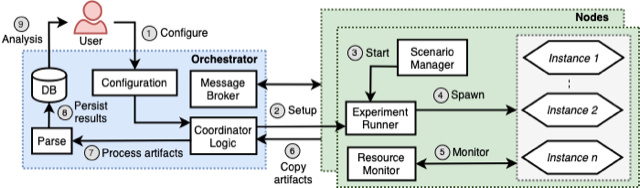

***********************
A Quick Overview
***********************

Gumby is an experiment runner framework to run local and distributed experiments.

The current supported DAS environments are the DAS5 and DAS6 clusters.
More information on the DAS environments can be found at:
`DAS5  <https://www.cs.vu.nl/das5/clusters.shtml>`_.
`DAS6  <https://www.cs.vu.nl/das6/clusters.shtml>`_.

The interaction between the researcher and the gumby framework can be presented als follows:

Installation

Prior to installing Gumby install the required dependencies for basic tests.
Those are the software packages: 
python-psutil
python-configobj
r-base

The way to install packages is specific for your Linux installation.
As an example on the Ubuntu or Debian based systems you may use:

.. code-block:: bash

   $ sudo apt-get install python-psutil python-configobj r-base

These dependencies can also be installed using the `pip` utility.
Please note that more elaborate experiments might require additional dependencies.

Next, clone the Gumby  repository from GitHub by running the following command:

.. code-block:: bash

   $ git clone https://github.com/tribler/gumby

In the Tutorials section you will find information on how to create your first Gumby experiment.

